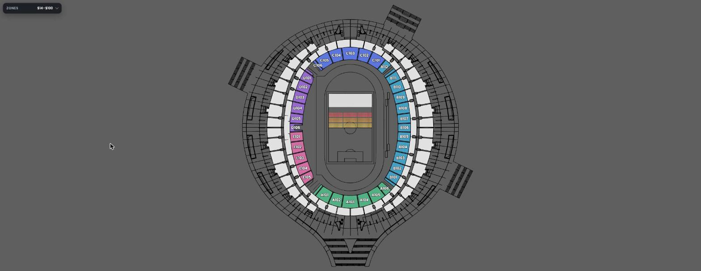
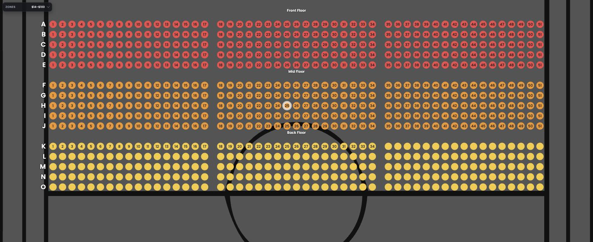
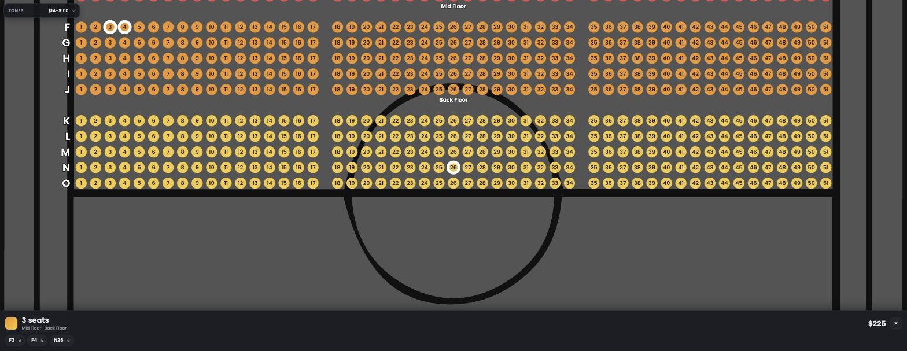
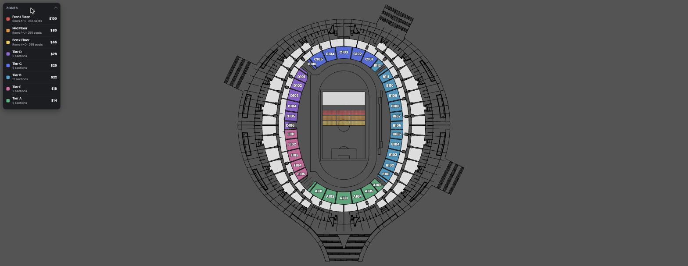

# Features

What the stadium seat demo can do today, from a user's point of view. For how it's built, see [README.md](README.md).

## Interactive seat map

- Renders straight from a Figma-exported SVG (`stadium_correct_size.svg`) — 765 individually selectable seats across 3 floor bands, plus 35 stand sections, all derived from the file's layer names at load time.
- Every zone looks the same at rest: a coloured, named section shape. Tapping a floor band reveals the seats inside it instead of trying to render 765 tiny targets up front; tapping a stand section goes straight to the quantity picker, since it has no seats of its own.
- Revealing a band fits the view to it and zooms in, with labels that fade in progressively so the map never looks cluttered or empty:
  - **Always visible:** the 35 stand-section names and the 3 collapsed band names.
  - **From ~3× zoom, once revealed:** the open band's title (`Front Floor`, `Mid Floor`, `Back Floor`) and row letters (`A`…`O`).
  - **From ~6× zoom, once revealed:** the seat number inside each seat.
- Tapping a different section — another band, a stand section, or empty backdrop — collapses whatever band was open. Tapping a seat while zoomed out below the pick threshold re-fits the view to its band instead of trying to hit a 10-pixel target.

## Zoom and pan, on every input device

One gesture engine drives mouse, trackpad, and touch identically:

| Action | Mouse                            | Trackpad                    | Touch            |
| ------ | -------------------------------- | --------------------------- | ---------------- |
| Pan    | drag                             | drag                        | one-finger drag  |
| Zoom   | scroll wheel (toward the cursor) | two-finger scroll, or pinch | two-finger pinch |
| Select | click                            | click                       | tap              |

Also: `+` / `−` to zoom, `0` to reset, arrow keys to pan, `Esc` to clear the current selection. A tap only registers if the pointer barely moved, so panning never accidentally selects something underneath it.

## Buying seats or a section — never both

A basket is either a handful of individual seats, or a quantity in one section — the two are different ways of buying a ticket, so the map only ever lets you do one at a time. Switching between them clears the other side and says why in a brief toast, rather than silently refusing the tap.

**Individual seats** — tap to add, up to 10 per order. Each seat appears as a removable chip in the bottom bar; tapping the seat again (or the chip's `×`) removes it. Seats can span bands at different prices, so the total is the sum of what each seat actually costs, not seat count times one price — and the colour swatch becomes a gradient when the selection spans more than one band.

**A section** — sold by quantity rather than seat-by-seat. Selecting one shows a `−` / `+` stepper clamped to how many are actually left (or 10, whichever is smaller), with the buttons visibly disabled at either end so it's obvious when you've hit the limit. The line total updates live as the quantity changes.

## Zones panel — the price list

Collapsed, it's a small pill in the corner showing the overall price range (`$14–$100`) so pricing is never more than a glance away. Tapping it expands into a full price list — one row per zone with its colour swatch, price, and what it actually contains (`Rows A–E · 255 seats` for a floor band, `12 sections` for a stand tier). Those counts come from the map itself, not from a separate description, so they can never drift out of sync with what's actually on screen.

## Realistic, tiered pricing

Eight pricing zones, each with one fixed price and colour:

| Zone        | Price | Why                                                                         |
| ----------- | ----: | --------------------------------------------------------------------------- |
| Front Floor |  $100 | Closest to the stage, sold seat-by-seat                                     |
| Mid Floor   |   $80 |                                                                             |
| Back Floor  |   $65 |                                                                             |
| Tier D      |   $28 | Ring sections, sold by quantity — ordered by actual distance from the stage |
| Tier C      |   $25 |                                                                             |
| Tier B      |   $22 |                                                                             |
| Tier E      |   $18 |                                                                             |
| Tier A      |   $14 | Farthest from the stage                                                     |

Section availability ("45 left") is generated per section but stays the same across reloads, so the numbers don't jump around every time the page is refreshed.

## Feedback and animation

- The bottom bar only appears once something is selected — it slides up and fades in on the first pick, and slides away when the selection is cleared, rather than sitting empty on screen the whole time.
- A toast message explains itself whenever a tap changes what kind of selection is active, or when a limit (10 seats, max quantity) is hit.
- The Zones panel expands and collapses with a smooth height animation, not an instant jump.
- All motion respects the OS-level "reduce motion" accessibility setting.

## Works everywhere, degrades gracefully

- No backend, no build step — a single static page that runs from any web server.
- Poppins is loaded from Google Fonts for the primary look; if that request fails or the device is offline, every piece of text falls back to the platform's system font rather than breaking.
- Sized for phones: the whole screen is the map (no toolbar eating into it), touch targets are finger-sized even where the underlying shape is a tiny 10px dot, and safe-area insets are respected on notched devices.
- If a future re-export of the SVG introduces a zone the app doesn't recognise, that zone still renders — with a fallback colour and price — instead of silently disappearing.

## Smooth at any zoom level

Panning and zooming stay responsive even with ~1,600 shapes on screen, including at the moment individual seat numbers first appear (previously the single slowest instant in the whole demo). See the [Performance section of the README](README.md#performance) for the measurements.

## What this demo does not do

It's a prototype of the seat-map interaction, not a booking flow:

- No checkout, payment, or order persistence — the basket lives only in memory and resets on reload.
- No login, real inventory, or backend of any kind.
- No accessibility pass beyond reduced-motion support (e.g. no screen-reader labelling of individual seats).
